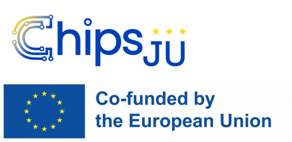

# PhaseUtils

Part of the [Phase.jl](https://github.com/JuliaPhase/Phase.jl) ecosystem.

<!-- DOI badge: add after first Zenodo release -->

 

## Overview

> **Note:** this overview is a temporary README generated by AI (Claude) and has not yet been reviewed by the author.

PhaseUtils contains core helpers and shared data structures for phase retrieval workflows: phase wrapping and unwrapping, tilt and coordinate-axes types, aperture finding and masking, windowing functions (Gaussian, Hann, Tukey), finite-difference and Fourier-based operators, and file utilities.

## Funding

This work is part of the 14AMI project (grant agreement No 101111948). The project is supported by the Chips Joint Undertaking and its members including the top-up funding by RVO (The Netherlands Enterprise Agency).

